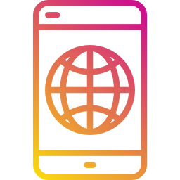

<p align="center">
  
</p>

<h1 align="center">WebView Multiplatform Mobile</h1>

**WebView Multiplatform Mobile** is a cross-platform library that provides a simple and convenient way to embed web content into your Android and iOS applications. Based on [CustomTabs](https://developer.android.com/reference/kotlin/androidx/browser/customtabs/package-summary) in Android and [SFSafariViewController](https://developer.apple.com/documentation/safariservices/sfsafariviewcontroller) in iOS, the library ensures safe and fast interaction with web content while maintaining the native user interface and performance.

>[Here's an example of how WebView looks](https://github.com/final-class/WebView-Multiplatform-Mobile#iphone-example)

### :fire: Features:
- **Cross-platform compatibility:** Support for Android and iOS to ensure a unified web content embedding experience.
- **Integration with CustomTabs (Android) and SFSafariViewController (iOS):** Utilize standard components of each platform for optimal performance and security.
- **Ease of use:** An intuitive API interface makes embedding web content easy and efficient for developers, with settings for each platform inspired by the Compose Modifier philosophy from Jetpack Compose.

------------

### :rocket: Подключение
1) Добавьте зависимость в commonMain вашего build.gradle
```java
implementation("io.github.final-class:webview-multiplatform-mobile:1.0.1")
```
2) Используйте WebView в своем общем коде
```kotlin
WebViewPlatform(url = "https://github.com/")
```

------------

### :gear: Настройки
WebView Multiplatform Mobile предоставляет ряд настраиваемых параметров для оптимизации поведения и внешнего вида ваших встроенных веб-компонентов, которые вдохновлены философией Compose Modifier в Jetpack Compose. Каждая настройка WebView похожа на применение Modifier к встроенному веб-компоненту, что делает их использование элегантным и удобным.

#### Настройки для Android устанавливаются следующим образом:
```kotlin
WebViewPlatform(
    url = "https://github.com/",
    androidSettings = AndroidWebViewModifier
        .showTitle(true)
        .urlBarHidingEnabled(true)
        ...
)
```
**Описание имеющихся настроек для AndroidWebViewModifier**
                    
Method  | Description
------------- | -------------
**showTitle**  | Sets whether the title should be shown in the custom tab.
**urlBarHidingEnabled**  | Set whether the url bar should hide as the user scrolls down on the page.
**shareState**  | Sets the share state that should be applied to the custom tab.
**instantAppsEnabled**  | Sets whether Instant Apps is enabled for this Custom Tab.
**toolbarCornerRadiusDp**  | Sets the toolbar's top corner radii in dp.
**activityHeight**  | Sets the Custom Tab Activity's initial height in pixels and the desired resize behavior.
**closeButtonPosition**  | Sets the position of the close button.
**startAnimations**  | Sets the start animations.
**exitAnimations**  | Sets the exit animations.
**scheme**  | Sets the color scheme that should be applied to the user interface in the custom tab.
**defaultColorSchemeParams**  | Sets the default CustomTabColorSchemeParams. This will set a default color scheme that applies when no AndroidScheme specified for current color scheme via scheme.
**darkColorSchemeParams**  | Sets the dark CustomTabColorSchemeParams. This will set a dark color scheme that applies when AndroidScheme.Dark specified for current color scheme via scheme.


#### Настройки для iOS устанавливаются следующим образом:
```kotlin
WebViewPlatform(
    url = "https://github.com/",
    iosSettings = IosWebViewModifier
        .barCollapsingEnabled(true)
        .entersReaderIfAvailable(true)
        ...
)
```

**Описание имеющихся настроек для IosWebViewModifier**
                    
Method  | Description
------------- | -------------
**barCollapsingEnabled**  | Enabled bar collapsing.
**entersReaderIfAvailable**  | A value that specifies whether Safari should enter Reader mode, if it is available.
**dismissButtonStyle**  | Sets dismiss button style.
**preferredBarTintColor**  | The color to tint the background of the navigation bar and the toolbar.
**preferredControlTintColor**  | The color to tint the control buttons on the navigation bar and the toolbar.

------------

### :iphone: Example

 

------------

### :man_technologist: Вклад
Мы приветствуем ваши вклады! Если у вас есть предложения по улучшению или обнаружили проблемы, пожалуйста, создайте Issue или Pull Request на нашем GitHub репозитории.

[](https://github.com/final-class)
